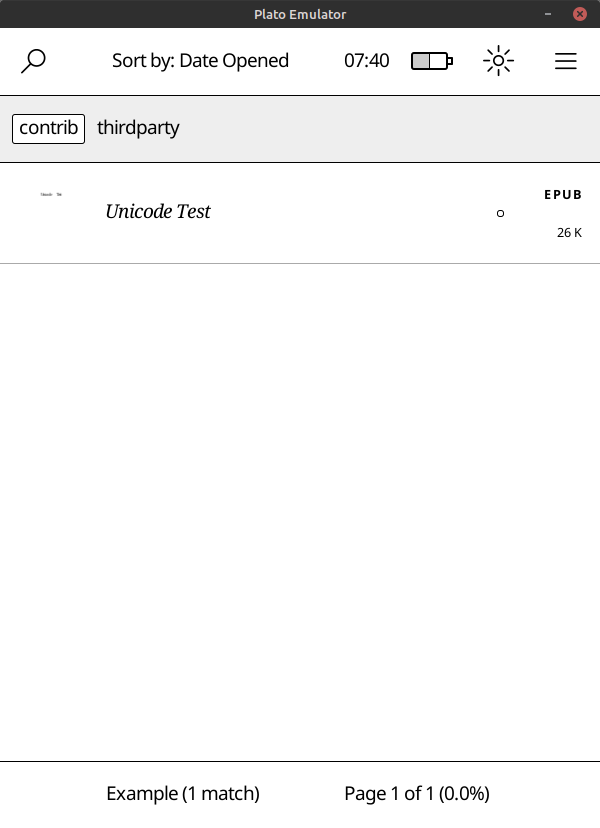

# Plato in Container

Emulator and builder Docker containers for [Plato](https://github.com/baskerville/plato) (a document reader for Kobo e-readers)

## About

The `Plato` Docker images are designed as `development containers`, designed to minimize `cargo build` time during the container execution time, to compile and test `Plato`'s code as fast as possible.

Currently, Docker images are somewhat optimized and work-in-progress; but the Docker images are fat (`builder`: ~1.8GB, `emulator`: ~2.5GB), `docker build` can take a long time and the containers probably run with more than necessary [options](https://docs.docker.com/engine/reference/run/#options).

## Motivation

Kobo devices require a specific `arm-linux-gnueabihf-gcc` version ([Linaro GCC 4.9-2017.01](https://github.com/kobolabs/Kobo-Reader/tree/master/toolchain)) to compile the required Plato packages to be able to run Plato successfully on e-readers. (At least, I could not get Plato to work with Debian's stable repo's compiler version for the e-reader.) On the Plato `emulator` side; this time, emulator asks for a specific [MuPDF](https://mupdf.com/) version to be up and running.

Inspired by [Jessie Frazelle](https://github.com/jessfraz)'s old blog post about [Docker containers on the desktop](https://blog.jessfraz.com/post/docker-containers-on-the-desktop/), not wanting the dependency files to spread everywhere and trying to avoid [dependency hell](https://en.wikipedia.org/wiki/Dependency_hell) on the host machine, this repo tries to diminish the file situation with Docker containers.

## Usage

Initially, clone this repo and then get the original `Plato` repo with:
```sh
$ cd plato-in-container
$ git submodule update --init
```

### Builder

For building and getting the package ready for using on Kobo e-readers:
```sh
$ docker compose run --rm plato-builder
```
or

```sh
$ docker compose run --rm plato-builder bash
# ./build.sh && ./dist.sh
```

### Emulator

For running the emulator and accessing the graphics device inside the container:
```sh
$ docker compose run --rm plato-emulator bash
# ./run-emulator.sh
```
or

```sh
$ docker compose run --rm plato-emulator
```

Emulator running inside Docker container and using local machine's display:

Home Screen  |  Reader Screen
-------------|-----------------
 | 

## Rationale

The reason `plato-in-container` is a separate repository and not a part of the original [Plato](https://github.com/baskerville/plato) repo is that these are not the first attempt at creating docker images for Plato. It appears the previous `Dockerfile`s were removed from Plato's repo because of a [lack of maintenance](https://github.com/baskerville/plato/commit/573a573) and it seems that Plato's maintainer was [not using](https://github.com/baskerville/plato/issues/255#issuecomment-1230743385) them. On the other hand, `emulator` image required `MuPDF` libraries to be installed on the host.

I didn't want to burden the maintainer with a similar PR without a track record. The separate repo also opens up an opportunity to experiment with Docker using `git subtrees`, `git submodules` and `symbolic links` to the locally cloned repo directories.

For reference, the previous Dockerfiles' history:
- [Dockerfile commits (builder)](https://github.com/baskerville/plato/commits/master/Dockerfile)
- [Dockerfile.dev commits (emulator)](https://github.com/baskerville/plato/commits/master/Dockerfile.dev)

Another (also somewhat older and obsolete) docker image repo:
- [HaoZeke/docker_platoBuilder](https://github.com/HaoZeke/docker_platoBuilder)
